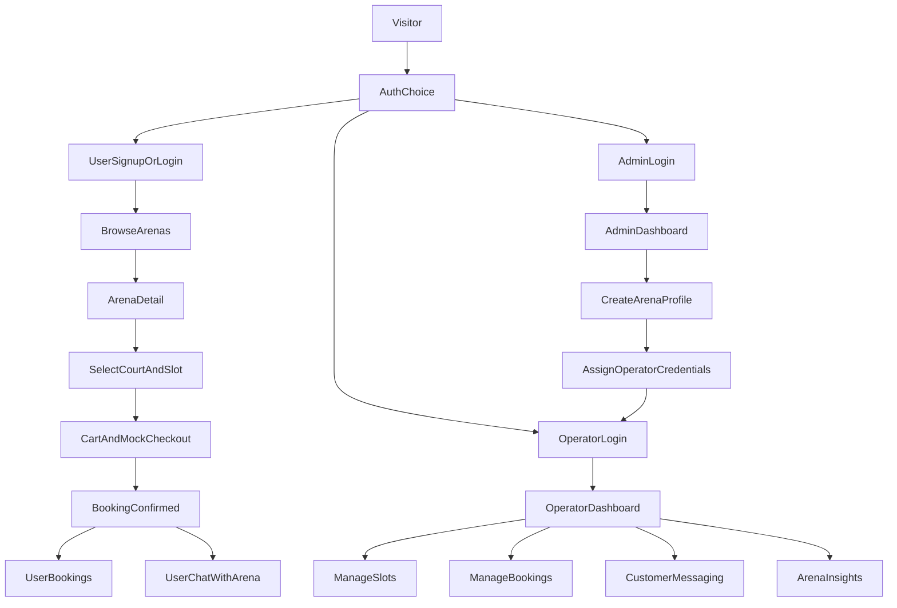
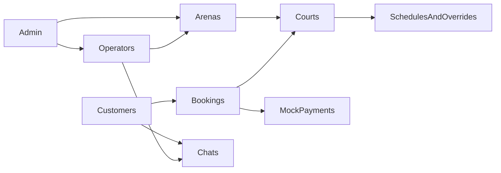

# Sports Arena Platform Blueprint

## Product Shape

Build the current project into a role-based web platform for one sports business that operates multiple arenas/branches.

Core roles:

- `Platform Admin`: controls the whole system, creates arena/operator accounts, manages all arenas, users, bookings, reports, and platform settings.
- `Arena Operator`: logs into an arena-specific dashboard created by admin, manages courts, slots, bookings, messages, and arena analytics.
- `End User`: signs up, browses arenas in their city, views court availability, books slots, chats with the arena, and manages their bookings.

This fits the current codebase well because the existing app already has:

- booking management screens in [C:\Users\Bilal Khan\Documents\Cross Courts\CrossCourts-main\CrossCourts-main\src\pages\BookingManagement\index.tsx](C:\Users\Bilal Khan\Documents\Cross Courts\CrossCourts-main\CrossCourts-main\src\pages\BookingManagement\index.tsx)
- booking history in [C:\Users\Bilal Khan\Documents\Cross Courts\CrossCourts-main\CrossCourts-main\src\pages\BookingHistory\index.tsx](C:\Users\Bilal Khan\Documents\Cross Courts\CrossCourts-main\CrossCourts-main\src\pages\BookingHistory\index.tsx)
- booking settings in [C:\Users\Bilal Khan\Documents\Cross Courts\CrossCourts-main\CrossCourts-main\src\pages\BookingSettings\index.tsx](C:\Users\Bilal Khan\Documents\Cross Courts\CrossCourts-main\CrossCourts-main\src\pages\BookingSettings\index.tsx)
- dashboard metrics in [C:\Users\Bilal Khan\Documents\Cross Courts\CrossCourts-main\CrossCourts-main\src\pages\Dashboard\ECommerce.tsx](C:\Users\Bilal Khan\Documents\Cross Courts\CrossCourts-main\CrossCourts-main\src\pages\Dashboard\ECommerce.tsx)
- a backend with bookings/courts/slots/auth in [C:\Users\Bilal Khan\Documents\Cross Courts\cross_courts_backend\backend\index.js](C:\Users\Bilal Khan\Documents\Cross Courts\cross_courts_backend\backend\index.js)

## Recommended Information Architecture

Use one web app with role-based routing.

### Public/User Surface

- `Home`: brand landing page, featured arenas, city search
- `Browse Arenas`: filters by city, sport, price, rating, availability
- `Arena Detail`: photos, location map, sports offered, available courts, rules, pricing
- `Court Availability`: date/time slot browser
- `Cart/Checkout`: mock payment only in phase 1
- `User Chat`: thread with selected arena
- `My Bookings`: upcoming, completed, cancelled
- `Profile`: account, saved arenas, notifications

### Arena Operator Surface

- `Operator Dashboard`: today’s bookings, occupancy, revenue mockups, upcoming slots
- `Bookings`: list/calendar view, confirm/edit/cancel bookings
- `Slot Manager`: default schedules, custom slots, blackout times
- `Courts & Sports`: manage futsal, cricket, baseball, paddle courts
- `Customers`: customer list, booking history, notes
- `Broadcasts/Messages`: send updates to bookers or selected customers
- `Chat Inbox`: user inquiries and live booking conversations
- `Arena Profile`: branch details, address, images, map pin, policies
- `Reports`: bookings, utilization, sport-wise summaries

### Platform Admin Surface

- `Admin Dashboard`: global KPIs across all arenas
- `Arena Management`: create arena profiles and assign operator accounts
- `Operator Accounts`: activate/deactivate/reset access
- `User Management`: view users, flag accounts, support actions
- `Booking Oversight`: global booking list and issue resolution
- `Content & Cities`: featured arenas, categories, system settings
- `Messaging Oversight`: audit announcements/chats if needed
- `Reports`: cross-arena trends and business-wide metrics

## Primary User Flows

## Data Model Direction

The current schema is single-layered and should evolve from generic `users/courts/bookings` into role-aware, arena-aware entities.

Recommended core entities:

- `users`: shared auth table with role = `admin | operator | customer`
- `arenas`: one row per venue/branch
- `arena_operators`: links operator users to allowed arenas
- `sports`: futsal, cricket, baseball, paddle
- `courts`: belongs to arena, belongs to sport
- `court_schedules`: default recurring schedule
- `court_slot_overrides`: date-specific slot changes/closures
- `bookings`: user + arena + court + slot + booking status + payment status mock
- `booking_messages`: messages tied to a booking or arena thread
- `arena_media`: photos, banners, logos
- `cities` or `locations`: searchable geography data
- `notifications`: booking updates, reminders, announcements

A cleaner domain split would look like:

## UI Wireframe Map

### Authentication

- One entry page with role-aware login tabs:
  - `Admin Login`
  - `Arena Operator Login`
  - `User Login / Register`
- Arena operators do not self-register.
- Users can self-register.

### User App Wireframe

- `Top Nav`: logo, city selector, sport filter, search, login/profile
- `Arena Listing`: cards with image, sports badges, distance/map, price from, rating, next available slot
- `Arena Detail`: hero image, map, sports tabs, court list, availability grid, policies, chat button
- `Booking Drawer/Cart`: selected slot, add-ons, mock payment, confirmation
- `My Bookings`: booking cards + reschedule/cancel/chat

### Arena Operator Wireframe

- `Left Sidebar`: Dashboard, Bookings, Slots, Courts, Customers, Messages, Reports, Profile
- `Dashboard`: KPI cards, bookings timeline, occupancy chart, recent customers
- `Slots`: calendar + court selector + bulk slot editor
- `Bookings`: table + filters + edit modal + walk-in/manual booking option
- `Messages`: broadcast composer + chat inbox

### Admin Wireframe

- `Left Sidebar`: Global Dashboard, Arenas, Operators, Users, Bookings, Reports, Settings
- `Arena Create/Edit`: branch details, location, sports offered, images, operating hours, assigned operator
- `Global Reports`: bookings by arena, utilization by sport, active users, growth trends

## How Current Code Maps To The Future

Keep and repurpose:

- [C:\Users\Bilal Khan\Documents\Cross Courts\CrossCourts-main\CrossCourts-main\src\pages\Dashboard\ECommerce.tsx](C:\Users\Bilal Khan\Documents\Cross Courts\CrossCourts-main\CrossCourts-main\src\pages\Dashboard\ECommerce.tsx) as the basis for both admin and operator dashboards
- [C:\Users\Bilal Khan\Documents\Cross Courts\CrossCourts-main\CrossCourts-main\src\pages\BookingManagement\index.tsx](C:\Users\Bilal Khan\Documents\Cross Courts\CrossCourts-main\CrossCourts-main\src\pages\BookingManagement\index.tsx) as operator bookings UI
- [C:\Users\Bilal Khan\Documents\Cross Courts\CrossCourts-main\CrossCourts-main\src\pages\BookingSettings\index.tsx](C:\Users\Bilal Khan\Documents\Cross Courts\CrossCourts-main\CrossCourts-main\src\pages\BookingSettings\index.tsx) as operator slot manager
- [C:\Users\Bilal Khan\Documents\Cross Courts\CrossCourts-main\CrossCourts-main\src\pages\BookingHistory\index.tsx](C:\Users\Bilal Khan\Documents\Cross Courts\CrossCourts-main\CrossCourts-main\src\pages\BookingHistory\index.tsx) as operator/admin booking history
- [C:\Users\Bilal Khan\Documents\Cross Courts\CrossCourts-main\CrossCourts-main\src\pages\CustomMessage\index.tsx](C:\Users\Bilal Khan\Documents\Cross Courts\CrossCourts-main\CrossCourts-main\src\pages\CustomMessage\index.tsx) as a starting point for announcements/broadcasts

Needs major extension:

- [C:\Users\Bilal Khan\Documents\Cross Courts\CrossCourts-main\CrossCourts-main\src\App.tsx](C:\Users\Bilal Khan\Documents\Cross Courts\CrossCourts-main\CrossCourts-main\src\App.tsx): split routes by role and add public browsing/user booking flows
- [C:\Users\Bilal Khan\Documents\Cross Courts\CrossCourts-main\CrossCourts-main\src\common\ProtectedRoute.tsx](C:\Users\Bilal Khan\Documents\Cross Courts\CrossCourts-main\CrossCourts-main\src\common\ProtectedRoute.tsx): enforce role-based access centrally
- [C:\Users\Bilal Khan\Documents\Cross Courts\CrossCourts-main\CrossCourts-main\src\api\auth.ts](C:\Users\Bilal Khan\Documents\Cross Courts\CrossCourts-main\CrossCourts-main\src\api\auth.ts) and [C:\Users\Bilal Khan\Documents\Cross Courts\CrossCourts-main\CrossCourts-main\src\api\courtService.ts](C:\Users\Bilal Khan\Documents\Cross Courts\CrossCourts-main\CrossCourts-main\src\api\courtService.ts): convert to a proper API layer with role-aware endpoints and env-based base URL
- [C:\Users\Bilal Khan\Documents\Cross Courts\cross_courts_backend\backend\index.js](C:\Users\Bilal Khan\Documents\Cross Courts\cross_courts_backend\backend\index.js): split monolith into auth, arenas, courts, bookings, reports, chat, and admin modules

## Recommended Build Order

### Phase 1: Foundation

- introduce formal roles: `admin`, `operator`, `customer`
- centralize auth/session and route guards
- define multi-arena schema with arena ownership and operator assignment
- add public/user-facing route group

### Phase 2: Arena Operations

- convert current booking management into operator-scoped dashboards
- add arena profile management, court management, and proper slot calendars
- make reporting scoped by arena and sport

### Phase 3: Customer Experience

- build arena listing, detail page, map/location, availability browsing, cart, and mock checkout
- add customer booking history and account pages
- add user-to-arena chat inbox

### Phase 4: Platform Admin

- global dashboards
- arena/operator/user management
- reporting and audit tools
- content/city/system settings

## Product Polish Recommendations

- use consistent terminology everywhere: `arena`, `court`, `sport`, `slot`, `booking`, `operator`
- rename `Padal` to `Paddle` or `Padel` consistently across UI and data
- remove template leftovers so the product feels purpose-built
- use a clearer visual split between user app and operator/admin dashboard
- move from hardcoded localhost URLs to environment config
- design around city-based discovery and map context because that is central to user value
- keep checkout mocked for now, but include booking states such as `pending`, `confirmed`, `cancelled`, `completed`

## Implementation Strategy For This Codebase

Start by reshaping the existing admin dashboard into a proper back-office shell, then add the public customer app as a parallel route group in the same frontend codebase. Reuse the current booking, slot, dashboard, and history modules for operator workflows instead of rewriting them first.

On the backend, first normalize auth and roles, then separate arena/court/booking/report logic into modules. Only after that should chat, broadcast messaging, and richer analytics be added, because those depend on a cleaner domain model and role permissions.